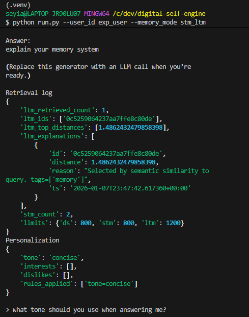
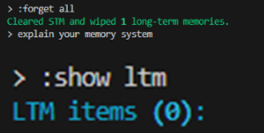

# Digital Self Memory & Personalization Engine

## One-line description
A prototype system that models users as evolving Digital Selves using layered memory, enabling context-aware personalization while enforcing privacy, forgetting, and user control.

---

## Problem motivation

Most AI assistants treat users as stateless prompt streams.  
This leads to repetitive interactions, shallow personalization, and poor user control over what is remembered.

This project explores:
- How a user can be represented as structured data
- How memory should be layered, retrieved, and updated
- How personalization can be useful without being invasive
- How forgetting and privacy can be first-class design constraints

---

## System overview

This is a **local prototype** (CLI-based) that:

- Accepts user text input
- Updates a structured **Digital Self**
- Stores memory across three layers
- Retrieves relevant long-term context selectively
- Applies simple, explainable personalization rules
- Enforces privacy constraints and explicit forgetting

No frontend, deployment, or cloud infrastructure is included by design.

---

## System architecture

The diagram below shows the high-level architecture of the Digital Self Memory & Personalization Engine.

It illustrates how:
- User input is orchestrated through a single control point
- The Digital Self mediates memory access via preferences and privacy rules
- Memory storage and retrieval are selective and explainable
- Long-term memory influences future responses without raw recall


---

## Memory architecture

The system implements **three explicit memory layers**:

### 1. Session Memory
- Stores the current conversation only
- Cleared automatically on exit
- Used for short-range continuity

### 2. Short-Term Memory (STM)
- Stores recent interactions with summaries
- Acts as a rolling context window
- Decays naturally as new interactions occur

### 3. Long-Term Memory (LTM)
- Vector-based semantic memory (Chroma)
- Stores selected user preferences and stable facts
- Retrieved by embedding similarity
- Filtered by user_id, sensitivity, and expiry
- Fully deletable by user command

---

## Retrieval & context assembly

When the user sends a message:

1. The query is embedded
2. Top-k relevant long-term memories are retrieved
3. Short-term memory summaries are included
4. The Digital Self state is injected
5. Strict size limits are enforced per block
6. Retrieval decisions are logged transparently

The system explicitly avoids **self-retrieval** on the same turn a memory is stored.

---

## Demonstrations

The following screenshots illustrate key system behaviors.

### Memory persistence & retrieval
Long-term memory enables preference persistence across turns and influences later responses.



---

### Explicit forgetting & user control
Users can delete all stored memories on demand, immediately affecting system behavior.



---

### Privacy-aware memory exclusion
Sensitive inputs are detected and intentionally excluded from long-term memory.


---

### Transparent retrieval logging
All long-term memory retrievals are logged with similarity scores and inclusion reasons.


---

## Personalization strategy

Personalization is derived from the Digital Self and recent context.

Current rules include:
- Tone adaptation (e.g. concise vs detailed)
- Preference persistence across sessions
- Topic-aware context prioritization

Rules are intentionally simple and explainable.

---

## Experiments & findings

Three experiments are included:

1. **Memory comparison**
   - Demonstrates the effect of STM + LTM vs no memory
   - Shows preference persistence and selective retrieval

2. **Personalization impact**
   - Compares generic vs personalized responses
   - Confirms personalization depends on stored memory

3. **Privacy edge case**
   - Sensitive input is detected and excluded from LTM
   - Verified via explicit inspection of memory state

All experiments include retrieval logs for auditability.

---

## Ethical considerations

This system:
- Avoids storing sensitive data
- Gives users explicit control over forgetting
- Makes memory usage visible and explainable
- Prioritizes relevance over raw recall

See `ETHICS.md` for details.

---

## Limitations & next steps

Limitations:
- Rule-based personalization (no learning)
- Simple topic extraction
- CLI interface only

Next steps:
- Replace stubbed response generator with an LLM
- Improve topic and preference extraction
- Add memory confidence or decay weighting
- Support user-scoped memory namespaces

---

## How to run

```bash
python run.py --user_id <user_id> --memory_mode stm_ltm


Commands:

:forget last
:forget all
:forget <keyword>
:show stm
:show ltm
:exit


```
